# Data model

> **Implemented in Phase 1** as 13 migrations under `supabase/migrations/` (see [phases.md](phases.md)). This doc reflects what was actually built. RLS for every table is in [rls-policies.md](rls-policies.md).
>
> **Deltas from the original draft**, for anyone diffing against an earlier read of this file:
>
> - **`admin_invites(email, role)`** is a new table (not in the original draft): `admin_users` keys on `user_id`, which doesn't exist until someone signs up, so a pending grant is keyed by email instead and resolved by the `auth.users` trigger on first matching signup (ADR-131).
> - **`admin_role`** values are `super_admin, manager, catalog, orders, support` (ADR-128), not the original `owner, admin, catalog_manager, order_manager, support`.
> - **Soft delete (`deleted_at`)** extends to `categories`, `brands`, and `variants` too, not just `profiles`/`products`.
> - **`order_items.image_path`** was added to the snapshot (name/variant label/MRP/price/GST/HSN **and image**).
> - **Order number / invoice number** are generated by `next_order_number()` / `next_invoice_number()` (counter tables + `security definer` functions), not a bare Postgres `SEQUENCE` — see ADR-124/125.
> - **`categories`** carries the return-policy override columns directly (`is_returnable`, `return_days`, `issue_report_hours`, `sealed_return_only`) plus a materialised `path` array; `category_return_window()` resolves the effective window up the tree, then from `store_config`, then a hardcoded fallback (ADR-126/127).
> - **Column-hiding is done with views**, not policies, since RLS filters rows, not columns: `variants_public` (hides `member_price_paise` from anon/guest), `inventory_available` (exposes only the computed `available` count), `payments_customer` (hides the `raw_event` webhook payload, scoped to the caller's own orders).
> - **Coupons are not directly browsable**: `lookup_coupon(code)` is the only read path for anon/guest/customer, so no one can enumerate every valid code.
> - **Storage buckets**: `product-images`, `banners` (both public read), `shopping-list-uploads` (private). `returns`, `invoices`, `branding` from the original draft are deferred to the phase that needs them (7, 7, 2).

## Conventions

### Phase 3 additions (pending migration application)

- `username_reservations(username, user_id, expires_at)` holds pending signup claims for 24 hours; it is backend-only. Confirmation publishes the username and profile fields atomically.
- `request_rate_limits(scope, subject, window_start, attempts)` is backend-only; its atomic limiter is reusable by Edge Functions. No passwords, tokens, raw email addresses or Google keys belong in this table.
- `serviceable_pincodes.min_order_paise` is a nonnegative integer, initially zero until business configuration is supplied. Customer/public access moves to the minimal `check_pincode` RPC.
- `pincode_waitlist` stores pincode plus exactly one email/phone contact, optional server-assigned user ID, notification timestamp, and creation timestamp. Contact uniqueness is case-insensitive for email. Historical `serviceability_requests` remains intact.
- `set_default_address` switches a caller's default address and profile pincode in one transaction.

- Postgres 17 (Supabase). Tables are `snake_case` and plural. Primary keys are `uuid default gen_random_uuid()` unless noted.
- Every table has `created_at timestamptz not null default now()`. Mutable tables also have `updated_at`, maintained by a trigger.
- **Money is `bigint` in paise** (`*_paise`). Prices are GST-inclusive (MRP norm). Percentages are `numeric(5,2)`.
- **`seller_id` on every product / variant / inventory / order / order_item row** (single seller today: the platform seller `slug = 'vivodha'`).
- Enums are Postgres enums, mirrored in `packages/shared/src/constants`.
- Snapshots: an order copies names, prices, and the address at purchase time. It never joins live catalog data for history.
- Soft delete (`deleted_at`) only where history matters (profiles, products). Everything else is hard delete or `is_active`.
- Text search: `products.search tsvector` (generated) + a `pg_trgm` index on `name`.
- Auth users live in `auth.users`. `public.profiles.id` = `auth.users.id`.

## Enums

| Enum                   | Values                                                                                                                 |
| ---------------------- | ---------------------------------------------------------------------------------------------------------------------- |
| `order_status`         | pending_payment, placed, packed, shipped, out_for_delivery, delivered, cancelled, return_requested, returned, refunded |
| `payment_method`       | upi, card, wallet, netbanking, cod                                                                                     |
| `payment_status`       | created, pending, captured, failed, refunded, partially_refunded                                                       |
| `delivery_mode`        | own_delivery, courier                                                                                                  |
| `product_status`       | draft, active, archived                                                                                                |
| `return_status`        | requested, approved, rejected, picked_up, received, refunded                                                           |
| `refund_status`        | pending, processing, processed, failed                                                                                 |
| `points_reason`        | earn_order, earn_booster, redeem_order, reverse_cancel, reverse_return, expire, admin_adjust                           |
| `admin_role`           | super_admin, manager, catalog, orders, support                                                                         |
| `shopping_list_source` | text, photo, upload                                                                                                    |
| `coupon_type`          | percent, flat, free_delivery                                                                                           |

## Tables

### Identity & customers

**profiles**: one row per auth user, including anonymous users.

| Column                 | Type                  | Notes                                       |
| ---------------------- | --------------------- | ------------------------------------------- |
| id                     | uuid PK               | FK → auth.users(id) on delete cascade       |
| full_name              | text                  |                                             |
| phone                  | text                  | 10-digit IN mobile, for delivery            |
| default_pincode        | text                  |                                             |
| marketing_opt_in       | boolean default false | DPDP consent record                         |
| consent_at             | timestamptz           | When the privacy notice was accepted        |
| last_active_at         | timestamptz           | Drives points expiry                        |
| deleted_at             | timestamptz           | Account-deletion request (Play requirement) |
| created_at, updated_at | timestamptz           |                                             |

Email lives only in `auth.users`. `is_anonymous` comes from `auth.users`.

**usernames**: unique lowercase usernames, kept separate so the login resolver never exposes emails.

| Column     | Type        | Notes                               |
| ---------- | ----------- | ----------------------------------- |
| username   | citext PK   | check `^[a-z0-9_]{3,20}$`           |
| user_id    | uuid unique | FK → profiles(id) on delete cascade |
| created_at | timestamptz |                                     |

**addresses**

| Column                 | Type             | Notes                                           |
| ---------------------- | ---------------- | ----------------------------------------------- |
| id                     | uuid PK          |                                                 |
| user_id                | uuid             | FK → profiles                                   |
| label                  | text             | home / work / other                             |
| full_name, phone       | text             | Recipient                                       |
| line1, line2, landmark | text             |                                                 |
| city, state            | text             | `state` drives GST place of supply              |
| pincode                | text             | check 6 digits                                  |
| lat, lng               | double precision | Optional (GPS / Maps later)                     |
| is_default             | boolean          | Partial unique index (user_id) where is_default |
| created_at, updated_at | timestamptz      |                                                 |

**admin_users** (roles are the `admin_role` enum, with permissions defined in RLS helper functions)

| Column                 | Type                 | Notes                                                    |
| ---------------------- | -------------------- | -------------------------------------------------------- |
| user_id                | uuid PK              | FK → profiles                                            |
| role                   | admin_role           |                                                          |
| seller_id              | uuid null            | Marketplace later: scopes a seller-admin to their seller |
| is_active              | boolean default true |                                                          |
| created_at, created_by |                      |                                                          |

Helper SQL functions (security definer, stable): `is_admin()`, `has_admin_role(roles admin_role[])`.

### Delivery

**serviceable_pincodes**

| Column                        | Type          | Notes                   |
| ----------------------------- | ------------- | ----------------------- |
| pincode                       | text PK       |                         |
| city, state                   | text          |                         |
| delivery_mode                 | delivery_mode | own_delivery / courier  |
| delivery_fee_paise            | bigint        |                         |
| free_delivery_threshold_paise | bigint        | Free-delivery nudge     |
| eta_text                      | text          | e.g. "Tomorrow 7-10 am" |
| cod_allowed                   | boolean       |                         |
| cod_max_paise                 | bigint null   |                         |
| is_active                     | boolean       |                         |
| created_at, updated_at        |               |                         |

**serviceability_requests** ("Coming soon, notify me")
| id uuid PK · pincode text · email text null · phone text null · user_id uuid null · notified_at timestamptz null · created_at · unique(pincode, coalesce(email, phone)) |

### Catalog

**sellers**

| Column                   | Type        | Notes                       |
| ------------------------ | ----------- | --------------------------- |
| id                       | uuid PK     |                             |
| slug                     | text unique | `vivodha` = platform seller |
| display_name, legal_name | text        |                             |
| gstin                    | text        | Invoice                     |
| fssai_license_no         | text        | Food                        |
| pan                      | text        |                             |
| registered_address       | jsonb       |                             |
| is_platform              | boolean     |                             |
| status                   | text        | active / suspended          |
| created_at, updated_at   |             |                             |

**categories** (tree)

| Column                   | Type                 | Notes                                           |
| ------------------------ | -------------------- | ----------------------------------------------- |
| id                       | uuid PK              |                                                 |
| parent_id                | uuid null            | FK → categories (self)                          |
| slug                     | text unique          |                                                 |
| name                     | text                 |                                                 |
| image_path               | text                 | Storage path                                    |
| sort_order               | int                  |                                                 |
| default_attribute_set_id | uuid null            | FK → attribute_sets                             |
| return_window_days       | int null             | Inherits from the parent / store_config if null |
| is_returnable            | boolean default true | Perishables may be false                        |
| is_active                | boolean              |                                                 |
| path                     | ltree or text[]      | Materialised path for fast subtree queries      |

**brands**: id uuid PK · slug unique · name · logo_path · is_active · created_at.

**attribute_sets**: generic variant and spec definitions (grocery, fashion, ...).

| Column       | Type        | Notes                                                                                 |
| ------------ | ----------- | ------------------------------------------------------------------------------------- |
| id           | uuid PK     |                                                                                       |
| code         | text unique | `grocery`, `fashion`, `home`                                                          |
| name         | text        |                                                                                       |
| option_types | jsonb       | `[{"code":"pack_size","label":"Pack size"}]` or `[{"code":"size"},{"code":"colour"}]` |
| spec_fields  | jsonb       | Detail fields: ingredients, nutrition, material, care, shelf_life…                    |

**products**

| Column                 | Type                           | Notes                                       |
| ---------------------- | ------------------------------ | ------------------------------------------- |
| id                     | uuid PK                        |                                             |
| seller_id              | uuid                           | FK → sellers                                |
| category_id            | uuid                           | FK → categories                             |
| brand_id               | uuid null                      | FK → brands                                 |
| attribute_set_id       | uuid                           | FK → attribute_sets                         |
| slug                   | text unique                    |                                             |
| name                   | text                           |                                             |
| description            | text                           |                                             |
| specs                  | jsonb                          | Validated against attribute_set.spec_fields |
| hsn_code               | text                           | GST                                         |
| gst_rate               | numeric(5,2)                   | 0 / 5 / 12 / 18 / 28                        |
| is_veg                 | boolean null                   | Food veg/non-veg mark                       |
| country_of_origin      | text                           | Legal Metrology                             |
| status                 | product_status                 |                                             |
| rating_avg             | numeric(3,2), rating_count int | Denormalised from reviews                   |
| search                 | tsvector generated             |                                             |
| deleted_at             | timestamptz                    |                                             |
| created_at, updated_at |                                |                                             |

**product_options**: the options a specific product uses.
| id uuid PK · product_id FK · code text (matches attribute_set option code) · label text · values text[] · position int · unique(product_id, code) |

**variants**

| Column                | Type           | Notes                                                    |
| --------------------- | -------------- | -------------------------------------------------------- |
| id                    | uuid PK        |                                                          |
| product_id            | uuid           | FK → products                                            |
| seller_id             | uuid           | FK → sellers                                             |
| sku                   | text unique    |                                                          |
| option_values         | jsonb          | `{"pack_size":"500 g"}` / `{"size":"M","colour":"Blue"}` |
| label                 | text           | Display label for the dropdown                           |
| mrp_paise             | bigint         |                                                          |
| price_paise           | bigint         | check ≤ mrp                                              |
| member_price_paise    | bigint null    | "Vivo price" (registered members)                        |
| barcode               | text null      |                                                          |
| shipping_weight_grams | int            | Courier                                                  |
| max_per_order         | int default 10 |                                                          |
| is_active             | boolean        |                                                          |
| position              | int            |                                                          |

**inventory**
| variant_id uuid · seller_id uuid · PK(variant_id, seller_id) · quantity int check ≥ 0 · reserved int check ≥ 0 · low_stock_threshold int · updated_at |

Available = quantity − reserved. Reserve and release happen only inside Edge Functions / RPCs.

**product_images**
| id uuid PK · product_id FK · variant_id uuid null · storage_path text · alt text · position int |

### Merchandising

**banners**
| id uuid PK · title text · image_path text · deep_link text (e.g. `vivodha://category/fruits`) · placement text (home_carousel, category_top) · category_id uuid null · sort_order int · starts_at, ends_at timestamptz · is_active boolean |

**home_sections**: the admin-configurable home layout.
| id uuid PK · type text (banner_carousel, category_grid, shopping_list_entry, rail_deals, rail_best_sellers, rail_top_picks, rail_recently_viewed, rail_collection) · title text · config jsonb (e.g. collection product ids, limit) · sort_order int · is_active boolean · platform text[] |

### Shopping

**carts**: one active cart per user (anonymous users included).
| id uuid PK · user_id uuid unique FK · pincode text · coupon_code text null · use_points boolean · updated_at |

**cart_items**
| id uuid PK · cart_id FK · variant_id FK · quantity int check > 0 · added_at · unique(cart_id, variant_id) |

**wishlists**: user_id · product_id · created_at · PK(user_id, product_id).

**recently_viewed**: user_id · product_id · viewed_at · PK(user_id, product_id). Trimmed to the last 50 per user.

**coupons**

| Column                                  | Type          | Notes                  |
| --------------------------------------- | ------------- | ---------------------- |
| id                                      | uuid PK       |                        |
| code                                    | citext unique |                        |
| description                             | text          |                        |
| type                                    | coupon_type   |                        |
| value                                   | bigint        | Percent × 100 or paise |
| max_discount_paise                      | bigint null   |                        |
| min_order_paise                         | bigint        |                        |
| starts_at, ends_at                      | timestamptz   |                        |
| usage_limit_total, usage_limit_per_user | int null      |                        |
| first_order_only                        | boolean       |                        |
| category_ids                            | uuid[] null   | Applicability          |
| seller_id                               | uuid null     | Marketplace later      |
| is_active                               | boolean       |                        |

**coupon_redemptions**
| id uuid PK · coupon_id FK · user_id FK · order_id uuid unique FK · discount_paise bigint · status text (applied, voided) · created_at |

### Orders & payments

**orders**

| Column                                                       | Type             | Notes                                             |
| ------------------------------------------------------------ | ---------------- | ------------------------------------------------- |
| id                                                           | uuid PK          |                                                   |
| order_number                                                 | text unique      | Human-friendly, e.g. `VV2610-000123` (format TBD) |
| user_id                                                      | uuid             | FK → profiles (anonymous or registered)           |
| seller_id                                                    | uuid             | FK → sellers                                      |
| contact_name, contact_phone, contact_email                   | text             | Snapshot (guest lookup)                           |
| shipping_address                                             | jsonb            | Snapshot                                          |
| pincode                                                      | text             |                                                   |
| delivery_mode                                                | delivery_mode    |                                                   |
| delivery_type                                                | text             | standard / slot (TBD)                             |
| delivery_slot                                                | tstzrange null   |                                                   |
| status                                                       | order_status     |                                                   |
| payment_method                                               | payment_method   |                                                   |
| payment_status                                               | payment_status   |                                                   |
| subtotal_mrp_paise                                           | bigint           | Σ MRP × qty                                       |
| subtotal_paise                                               | bigint           | Σ price × qty                                     |
| coupon_discount_paise                                        | bigint           |                                                   |
| points_redeemed                                              | int              |                                                   |
| points_discount_paise                                        | bigint           |                                                   |
| delivery_fee_paise                                           | bigint           |                                                   |
| total_paise                                                  | bigint           | Payable                                           |
| tax_paise                                                    | bigint           | GST included in the total                         |
| points_to_earn                                               | int              | Computed at placement                             |
| return_window_ends_at                                        | timestamptz      | Set at delivery                                   |
| invoice_number                                               | text unique null | Sequential per FY (GST)                           |
| invoice_path                                                 | text null        | Storage                                           |
| cancel_reason                                                | text null        |                                                   |
| placed_at, packed_at, shipped_at, delivered_at, cancelled_at | timestamptz      |                                                   |
| created_at, updated_at                                       |                  |                                                   |

**order_items**
| id uuid PK · order_id FK · product_id · variant_id · seller_id · name · variant_label · sku · hsn_code · gst_rate · quantity int · mrp_paise · unit_price_paise · line_total_paise · tax_paise · points_multiplier numeric · returned_quantity int default 0 |

**order_status_history**: append-only.
| id bigint identity PK · order_id FK · status order_status · note text · changed_by uuid null (null = system) · created_at |

**payments**

| Column                        | Type               | Notes                                  |
| ----------------------------- | ------------------ | -------------------------------------- |
| id                            | uuid PK            |                                        |
| order_id                      | uuid               | FK                                     |
| provider                      | text               | razorpay / cod                         |
| method                        | payment_method     |                                        |
| amount_paise                  | bigint             |                                        |
| currency                      | text default 'INR' |                                        |
| status                        | payment_status     |                                        |
| provider_order_id             | text unique null   | Razorpay order id                      |
| provider_payment_id           | text unique null   |                                        |
| error_code, error_description | text               |                                        |
| raw_event                     | jsonb              | Minimal webhook payload (no card data) |
| created_at, updated_at        |                    |                                        |

**refunds**
| id uuid PK · order_id FK · payment_id uuid null · return_id uuid null · amount_paise bigint · method text (original, upi, bank, points) · status refund_status · provider_refund_id text · reason text · created_by uuid · created_at · processed_at |

**returns**
| id uuid PK · order_id FK · user_id FK · status return_status · reason text · items jsonb (`[{order_item_id, quantity}]`) · photo_paths text[] · admin_note text · created_at, updated_at |

**shipments**
| id uuid PK · order_id FK · seller_id · mode delivery_mode · carrier text · awb text · tracking_url text · status text · rider_name, rider_phone text (own delivery) · shipped_at, delivered_at |

### Loyalty

**points_ledger**: **append-only** (no update/delete grants, trigger blocks changes).

| Column     | Type               | Notes                                  |
| ---------- | ------------------ | -------------------------------------- |
| id         | bigint identity PK |                                        |
| user_id    | uuid               | FK → profiles                          |
| delta      | int                | + earn / − redeem / − expire           |
| reason     | points_reason      |                                        |
| order_id   | uuid null          |                                        |
| note       | text               | Required for admin_adjust              |
| created_by | uuid null          | Admin for adjustments, null for system |
| created_at | timestamptz        |                                        |

View **points_balances** (user_id, balance = Σ delta, last_activity_at). Pending points = `orders.points_to_earn` where delivered and the return window is still open.

**points_boosters**: category 2× boosters.
| id uuid PK · category_id FK · multiplier numeric(3,1) default 2 · starts_at, ends_at · is_active |

### AI shopping list

**shopping_lists**
| id uuid PK · user_id FK · source shopping_list_source · raw_text text · image_path text · status text (pending, parsing, parsed, failed, added_to_cart) · model text · error text · created_at, updated_at |

**shopping_list_items**
| id uuid PK · list_id FK · position int · raw_line text · parsed_name text · quantity numeric · unit text · matched_variant_id uuid null · confidence numeric(4,3) · status text (matched, unmatched, confirmed, removed) |

### Engagement

**notifications**
| id uuid PK · user_id FK · type text · title text · body text · data jsonb (deep link) · channel text (push, email, in_app) · sent_at · read_at · created_at |

**device_tokens**: user_id · token text unique · platform text · app_version · updated_at (added for push in Phase 11).

**reviews**
| id uuid PK · product_id FK · user_id FK · order_item_id uuid unique (verified purchase only) · rating smallint 1-5 · title · body · status text (pending, published, hidden) · created_at |

### Configuration

**store_config**: a single row per deployment (`id = 'default'`), which makes the app re-skinnable.

| Column                 | Type    | Notes                                                                                                                                                                                                 |
| ---------------------- | ------- | ----------------------------------------------------------------------------------------------------------------------------------------------------------------------------------------------------- |
| id                     | text PK | 'default'                                                                                                                                                                                             |
| store_name             | text    |                                                                                                                                                                                                       |
| logo_path              | text    |                                                                                                                                                                                                       |
| theme                  | jsonb   | Token overrides (colours, radii)                                                                                                                                                                      |
| features               | jsonb   | Enabled modules                                                                                                                                                                                       |
| business               | jsonb   | `points: {earnRupeesPerPoint:100, pointValueRupees:1, minRedeem:50, maxRedeemPct:20, boosterMultiplier:2, expiryMonths:12}`, `delivery`, `cod`, `returns: {defaultWindowDays}`, `orderTimeoutMinutes` |
| legal                  | jsonb   | Legal name, GSTIN, FSSAI no., addresses, grievance officer                                                                                                                                            |
| support                | jsonb   | Email, phone, hours                                                                                                                                                                                   |
| updated_at, updated_by |         |                                                                                                                                                                                                       |

**feature_flags**
| key text PK · enabled boolean · description text · rules jsonb (platform, min_app_version, percent, user allowlist) · updated_at |

## ERD (core relationships)

```mermaid
erDiagram
  profiles ||--o| usernames : has
  profiles ||--o{ addresses : has
  profiles ||--o| admin_users : "may be"
  admin_invites ||--o| admin_users : "resolves to (by email, on signup)"
  profiles ||--o| carts : owns
  carts ||--o{ cart_items : contains
  cart_items }o--|| variants : references
  profiles ||--o{ wishlists : saves
  profiles ||--o{ recently_viewed : views
  sellers ||--o{ products : sells
  sellers ||--o{ variants : sells
  sellers ||--o{ inventory : stocks
  categories ||--o{ categories : parent_of
  categories ||--o{ products : groups
  brands ||--o{ products : brands
  attribute_sets ||--o{ products : defines
  products ||--o{ product_options : has
  products ||--o{ variants : has
  products ||--o{ product_images : has
  variants ||--o{ inventory : "stock per seller"
  categories ||--o{ points_boosters : boosts
  profiles ||--o{ orders : places
  sellers ||--o{ orders : fulfils
  orders ||--o{ order_items : contains
  order_items }o--|| variants : snapshot_of
  orders ||--o{ order_status_history : logs
  orders ||--o{ payments : paid_by
  orders ||--o{ refunds : refunded_by
  orders ||--o{ returns : has
  orders ||--o{ shipments : shipped_as
  coupons ||--o{ coupon_redemptions : redeemed
  orders ||--o| coupon_redemptions : uses
  profiles ||--o{ points_ledger : earns
  orders ||--o{ points_ledger : affects
  profiles ||--o{ shopping_lists : creates
  shopping_lists ||--o{ shopping_list_items : contains
  shopping_list_items }o--o| variants : matched_to
  profiles ||--o{ notifications : receives
  products ||--o{ reviews : reviewed_in
  order_items ||--o| reviews : verifies
  serviceable_pincodes ||--o{ serviceability_requests : "requested for"
```

## Storage buckets

Implemented in migration 13. Policies mirror the equivalent table's RLS.

| Bucket                  | Public | Contents                                                                        |
| ----------------------- | ------ | ------------------------------------------------------------------------------- |
| `product-images`        | yes    | Product/variant images, read by anyone; write by catalog+ admins                |
| `banners`               | yes    | Banner artwork, read by anyone; write by catalog+ admins                        |
| `shopping-list-uploads` | no     | User list photos, under `{user_id}/…`; owner + support/manager/super_admin only |

Deferred to the phase that needs them: `returns` (Phase 7, return photos), `invoices` (Phase 7, GST invoice PDFs via signed URL), `branding` (Phase 3, store_config logo/theme assets — `store_config.logo_url` can point at any public URL in the meantime).
