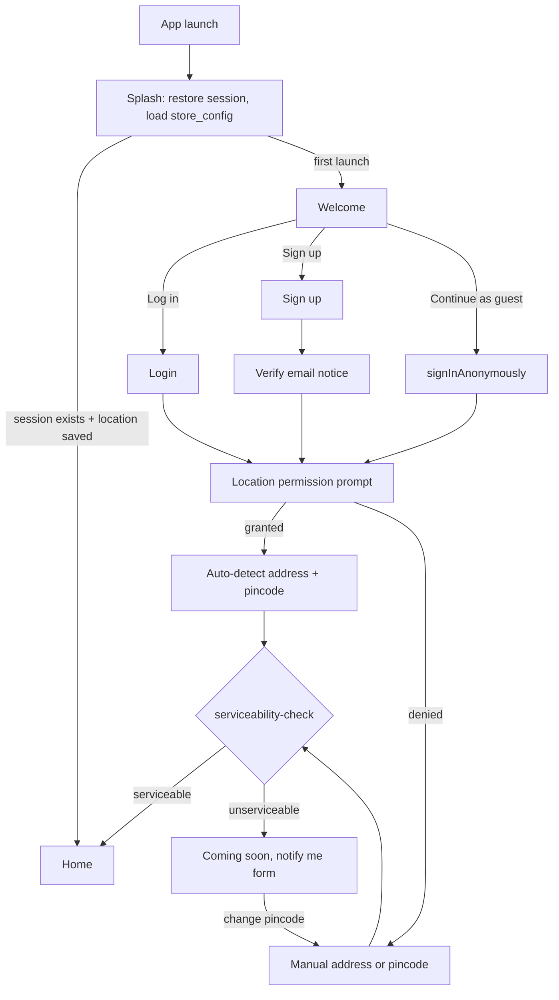
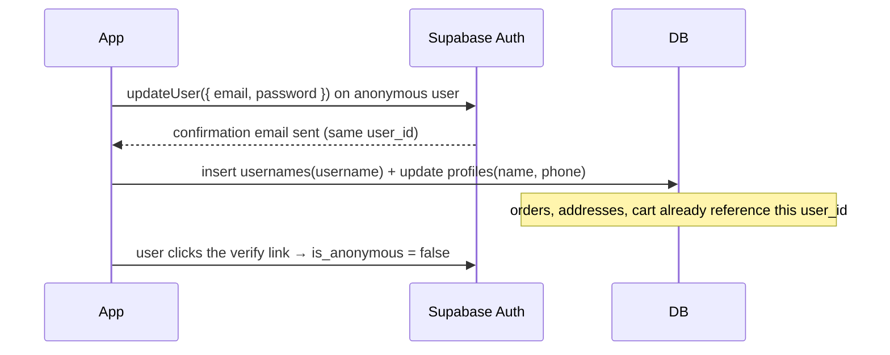
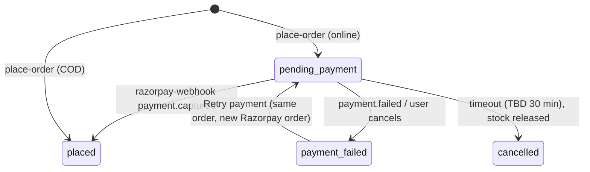
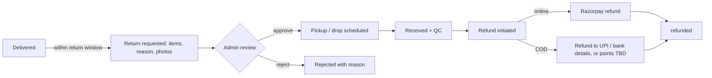

# User flows

Flows are written as steps plus Mermaid diagrams. "Server" means Postgres (RLS / RPC) or an Edge Function ([edge-functions.md](edge-functions.md)).

## 1. Onboarding

- Location denial never blocks the user. The pincode is saved locally and on `profiles.default_pincode` for registered users.
- The serviceability result is cached for the session. Home shows "Delivering to <pincode>".

## 2. Guest checkout

1. The guest (anonymous session) adds items to the cart. The cart is stored server-side under the anonymous `user_id`.
2. Checkout → **Contact**: name, phone, email (zod `guestContactSchema`).
3. **Address**: a new address, saved to `addresses` for the anonymous user.
4. **Delivery type**: options for the pincode (e.g. standard / slot, TBD - owner decision).
5. **Payment**: UPI / card / wallet (Razorpay) or COD (if allowed for the pincode and order value).
6. `place-order` → order number shown → **"Create account to keep your orders"** prompt.
7. Order lookup later: order number + email or phone.

## 3. Registered checkout

Same as guest, except contact details are prefilled from `profiles`, saved addresses are offered, Vivo Points redemption is available, and Vivo price applies.

## 4. Guest → account conversion

- If the email already belongs to an account, the user logs in to that account instead, and the guest orders are **linked by email + order number** through a support/admin action (TBD - owner decision: automatic merge vs manual).

## 5. Payment outcomes

| Outcome     | User sees                                                          | System                                                                                   |
| ----------- | ------------------------------------------------------------------ | ---------------------------------------------------------------------------------------- |
| **Success** | Confirmation with order number, ETA, and points to be earned       | Webhook verifies the signature → `payments.status = captured` → `orders.status = placed` |
| **Failure** | "Payment failed" with reason, plus **Retry** and **Change method** | The order stays `pending_payment`, and stock stays reserved until the timeout            |
| **Pending** | "Confirming your payment…" with polling (the UPI collect delay)    | The client never marks an order paid; only the webhook does. The timeout job cancels     |

## 6. Cancellation

- The customer can cancel while the status is `placed` (before `packed`). After that, they contact support.
- `cancel-order`: status → `cancelled`, stock released, coupon redemption voided, redeemed points reversed (`reverse_cancel` ledger entry), and a refund is initiated for online payments.
- The admin can cancel at any status before `delivered` (with a reason).

## 7. Return & refund

- The return window is per category (perishables may be "no return, replace/refund on issue", TBD - owner decision).
- Points earned on returned items are not credited, or are reversed (`reverse_return`).

## 8. Vivo Points: earn / redeem / expiry

- **Earn.** At delivery, `floor(eligible_value / 100)` points are computed (× booster multiplier per category) and shown as _pending_. The `points-credit` job credits them after the return window ends, as an `earn_order` / `earn_booster` ledger row.
- **Redeem.** In the cart toggle, the usable amount is `min(balance, 20% of order value)`, but only if `balance ≥ 50`. `place-order` writes a `redeem_order` row (negative) atomically with the order.
- **Expiry.** The `points-expiry` job finds users with no qualifying activity for 12 months and writes an `expire` row equal to the remaining balance. A reminder notification goes out 30 days before (TBD).
- **Vivo price.** Registered members see the `variants.member_price` where set. Guests see "Vivo price ₹X, sign in to get it".

## 9. Serviceability

1. Input: pincode (from GPS reverse-geocode or manual entry).
2. `serviceability-check` → `{ serviceable, mode, fee, freeDeliveryThreshold, etaText, codAllowed }`.
3. Unserviceable → the notify-me form inserts into `serviceability_requests` (one per contact + pincode).
4. The pincode is re-checked when the address changes at checkout. If the cart has items unavailable for that pincode, they are flagged.
